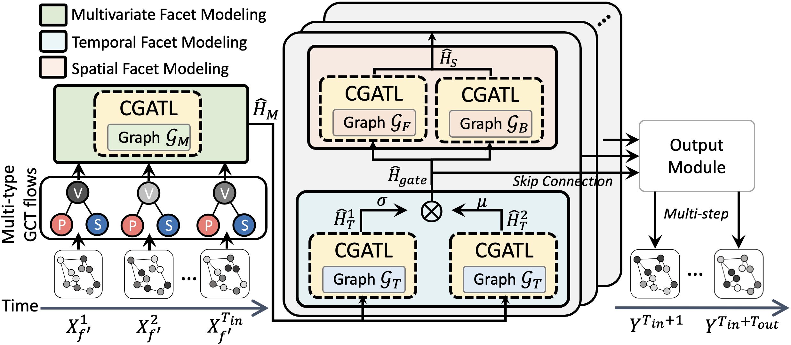

# Experimental Code for: Graph Multi-View Attention (GMVM)



This is a Pytorch implementation of Graph Multi-View Attention (GMVM) for CIKM'23

## Data Preparation

### Raw Dataset
The original multi-type GCT flows data, including Vehicle (i.e., `Vehicle_All.csv`), Pedestrian (i.e.,`Pedestrian_All.csv`), and Stationary (i.e.,`Stationary_All.csv`), are available at
```
../Data
```

These files are shared with a similar format.

Here is an example from `Vehicle_All.csv`:

|                     | Road ID 1 | Road ID 6 | Road ID 11 | ... | Road ID 202202 |
|:-------------------:|:--------------:|:--------------:|:--------------:|:--------------:|:--------------:|
| 2022/08/28 00:05    |   8.0        |   3.0        |   12.0        |    ...         |    12.0         |
|         ...         |    ...         |    ...         |    ...         |    ...         |    ...         |
| 2022/09/14 17:00 |   62.0        |   10.0        |   35.0        |    ...         |    36.0         |
| 2022/09/14 17:05 |   127.0        |   12.0        |   34.0        |    ...         |    66.0         |
| 2022/09/14 17:10 |   82.0        |   12.0         |   36.0        |    ...         |    44.0         |
|         ...         |    ...         |    ...         |    ...         |    ...         |    ...         |
| 2022-03-31 23:55:00 |   8.0        |   0.0        |   7.0        |    ...         |    1.0         |

### Processed dataset in train/test/val 

#### How to Create Processed dataset:
Run the [scripts](https://github.com/liyaguang/DCRNN/blob/master/scripts/generate_training_data.py) to generate the train/test/val dataset.

#### Processed train/test/val dataset Provided:

We split the raw dataset in a 7:2:1 ratio to generate training, testing, and validation data. 
The training, testing, and validation data structure are now available at:
```
https://drive.google.com/drive/folders/1mOuSkPpbGeq_Q-jVwKaq_qk-YU_mlwn4?usp=sharing
```
Each type has training/testing/validation data structures, respectively.

### Graph Construction

#### How to Create Graph Construction

As the implementation is based on pre-calculated distances between road segments, we provided the CSV file with
- road segment ID and their GPS: `coordinates.csv`
- road section distances: `distances.txt`
  
are available at:
```
../Data
```

Run the [script](https://github.com/liyaguang/DCRNN/blob/master/scripts/gen_adj_mx.py) to generate the Graph Structure used in the experiments.

#### Graph Construction Provided
The processed Graph Structure of Road Segment Network, i.e., `adj_mat_2022_hsin_21_locs.pkl`, are also available at:
```
https://drive.google.com/drive/folders/1mOuSkPpbGeq_Q-jVwKaq_qk-YU_mlwn4?usp=sharing
```

## Model Training

The code for each part of the framework architecture is provided above.

Please set the location of the dataset and graph structure file in `argparse.ArgumentParser()` of `parameters.py`

And put all codes together to run the training process.

Or directly run the `Jupyter Notebook` for model training with `GMVM.ipynb`

Dataset for training should put in:
```
../Data
```

Training Model will generate in:
```
./save
```
