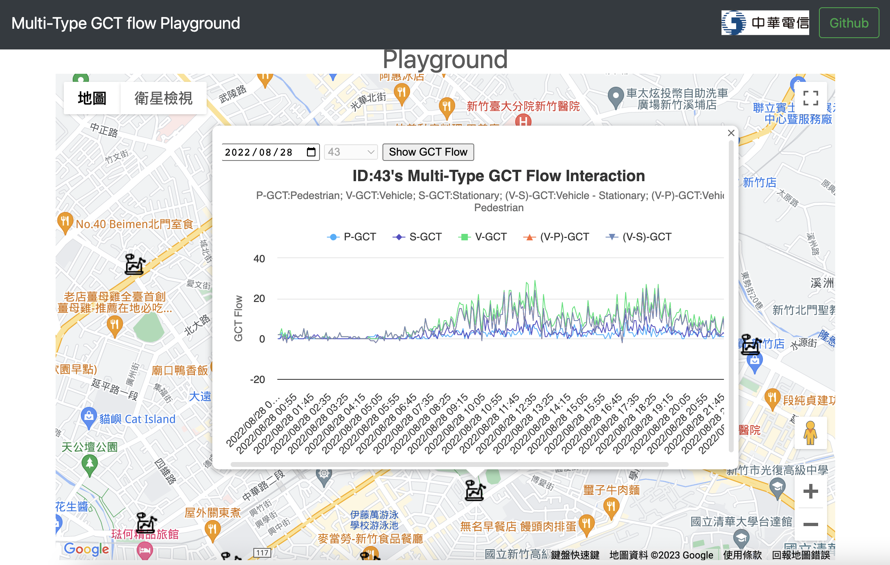
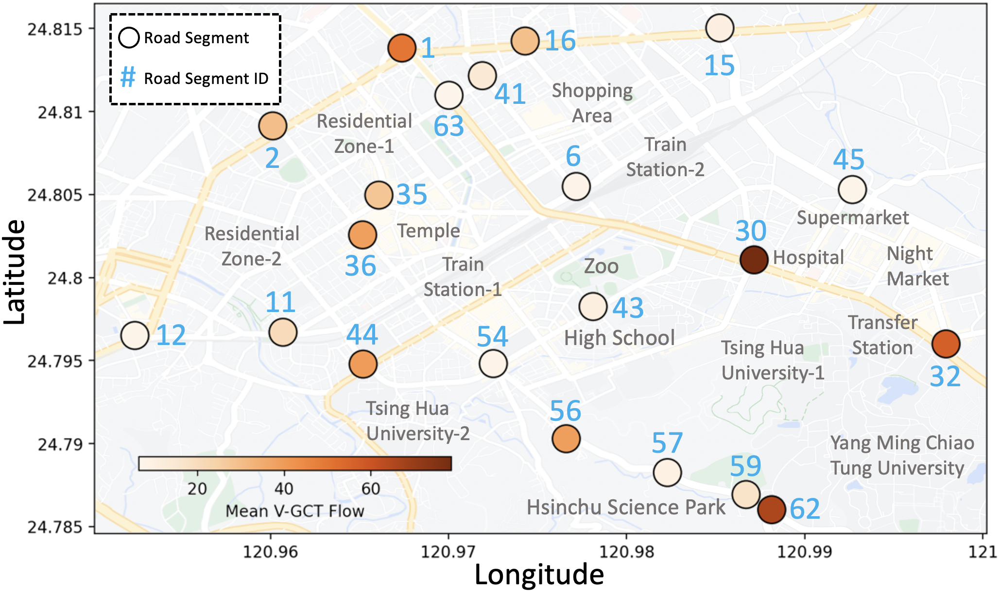
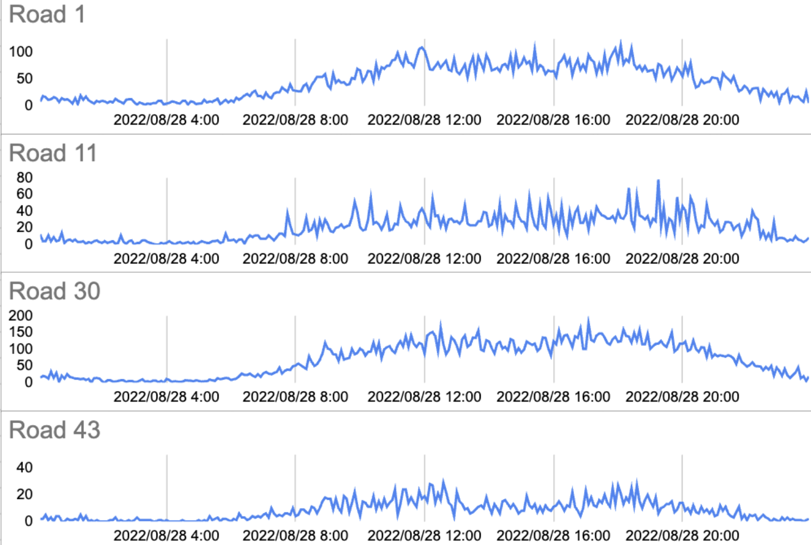
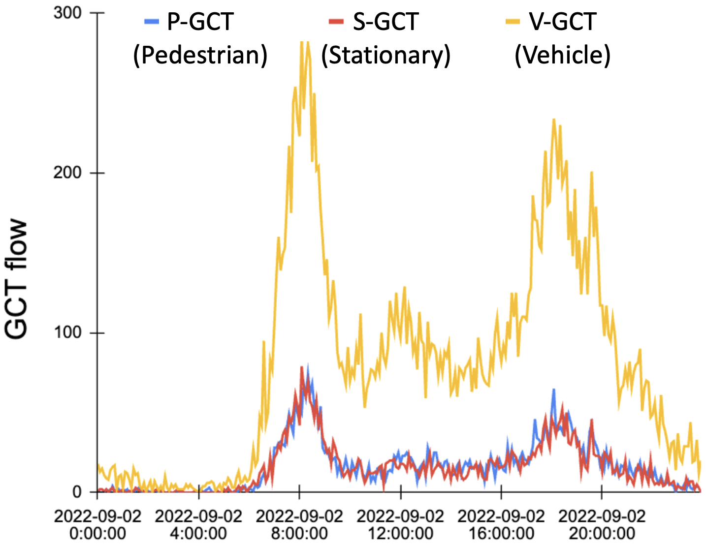
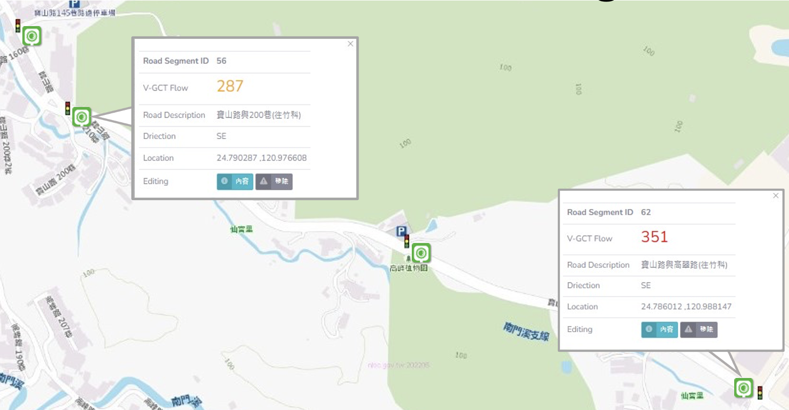
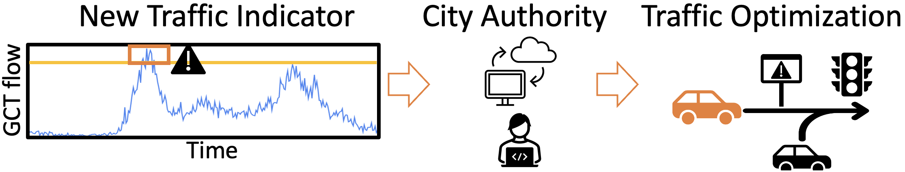

# Supplemental Material: Geographical Cellular Traffic (GCT) dataset 

This is the original data repository of Geographical Cellular Traffic.
This prototypical dataset cooperated with [Chunghwa Telecom laboratories](https://www.chttl.com.tw/en/index.html)

The dataset materials are provided in the following.
The experimental code will be public in ./Model

## DEMO Playground
https://cylin-cmlab.github.io/GCT-flow-demo

## Overview

### GCT
GCT is cellular traffic with estimated GPS coordinates obtained from triangulation, indicating where the traffic was generated. 
Each GCT is classified\footnote{The algorithm is the telecom company's confidential trade secret.} into three categories: vehicle, pedestrian, and stationary.

Here are the partial examples of GCT records (*IMEI numbers were hashed to protect privacy):

|       IMEI     |    Latitude    |    Longitude   |      Time      |      Type      |
|:--------------:|:--------------:|:--------------:|:--------------:|:--------------:|
|       ...      |    ...         |    ...         |    ...         |    ...         |   
|     gn...mE    |    24.78585    |   120.98825    | 09/25 17:59:58 |     vehicle    |
|     gn...GI    |    24.78601    |   120.98838    | 09/25 18:00:00 |    pedestrian  |
|     gn...mU    |    24.78608    |   120.98829    | 09/25 18:00:05 |    stationary  |
|       ...      |    ...         |    ...         |    ...         |    ...         |  

### Road segment
The road segments are defined as 20m x 20m areas, which is based on the average road size in our proof-of-concept (POC) area in Hsinchu, Taiwan. 
All the GCTs listed in the above table are located within the predefined road segments, nearby various regional functionality.

Here are the distribution examples of selected road segments:

### GCT Flow
We define GCT flow as the total quantity of GCT within a fixed interval (e.g., 5 minutes) using public traffic flow datasets.

Below are partial examples of GCT flows for different road segments:

With multi-type GCT (as shown in the "Type" data field in the table above), there are various GCT flows, 
including vehicle (V-GCT), pedestrian (P-GCT), and stationary (S-GCT) flows.

Here is an example of the **multi-type GCT flows** for one road segment:

## Experimental Materials Providing 

### I. Graph Structure of Road Segments Network

We provide instructions on how to construct a road segment network in the Hsinchu POC area:

1. GPS coordinates for each road segment ID: We provide the ID and corresponding GPS coordinates for each road segment, available at: [Google Drive](https://drive.google.com/file/d/1Oe1Dp3IRHg-hnB9HlMaGqXbQEEihXQC3/view?usp=sharing)     

2. Distance between connected road segments (in meters): We provide a file containing the distances between each pair of road segments, available at: [Google Drive](https://drive.google.com/file/d/1H4c-NrvMv6eWB15WyaAek809ZK0nWp0V/view?usp=sharing)     

3. Graph structure construction: To generate the graph structure based on the **distances.txt** file provided above, please follow the [script](https://github.com/liyaguang/DCRNN/blob/master/scripts/gen_adj_mx.py). 

We also provide a road network structure file for use in the experiments, available at: [Google Drive](https://drive.google.com/file/d/1GpCJnobp8BO_J48HW2zmCsUfXST-lmX1/view?usp=sharing) 

### II. Muti-type GCT flows dataset for training

There are three types GCT flows, which are based on **Type** in GCT table to calculate seperately.
1. V-GCT flow:
The original CSV file for V-GCT flow is available on: [Google Drive](https://drive.google.com/file/d/1rEv9GOPMKAjk-WZuK7Zd7jLSWCKTxOHr/view?usp=share_link) 

Here are the partital examples of V-GCT flow:
|                     | Road Segment 1 | Road Segment 6 | Road Segment 11 | ... |
|:-------------------:|:--------------:|:--------------:|:--------------:|:--------------:|
| 2022/08/28 00:05:00 |   8.0        |   3.0        |   12.0        |    ...         |
|         ...         |    ...         |    ...         |    ...         |    ...        |
| 2022/08/28 19:05:00 |   55.0        |   12.0        |   46.0        |    ...         | 
| 2022/08/28 20:05:00 |   77.0        |   12.0        |   41.0        |    ...         |  
| 2022/08/28 20:10:00 |   60.0        |   20.0         |   20.0        |    ...         | 
|         ...         |    ...         |    ...         |    ...         |    ...         | 

2. P-GCT flow:
The original CSV file for P-GCT flow is available on: [Google Drive](https://drive.google.com/file/d/1k4Gtzrvk-AbE5zkhJrfYm2WTp2bzaiNj/view?usp=sharing) 

3. S-GCT flow:
The original CSV file for S-GCT flow is available on: [Google Drive](https://drive.google.com/file/d/1rimg03CYIJaGVnJ87-WGUW_4H_-S9K9K/view?usp=share_link) 

To generate the **train/val/test datasets** for each type of GCT flow as {train,val,test}.npz, please follow the [script](https://github.com/liyaguang/DCRNN/blob/master/scripts/generate_training_data.py),
using the CSV files provided above.

The **processed train/val/test data structures** are available on: [Google Drive](https://drive.google.com/drive/folders/13lhfHRVjcHuQK0eQXYJYK_4_LLk7Wz57?usp=sharing)

## Examples of Potential for Intelligent Tranportation System

### I. Real-time monitoring:
GCT flow can be used to monitor crowd density and mobility on each road segment. During peak hours or festivals, it can monitor crowd activities to ensure public safety.

### II. Emerging traffic indicator:
GCT flow can be regarded as a traffic performance indicator. When the number of GCT flows exceeds a predefined threshold at a certain time, it can alert the transportation authority to respond and ensure efficient allocation of traffic resources, reducing road congestion, and so on.

**We provide these initial potential applications, hoping to pave the way for the application of GCT in transportation management!**
